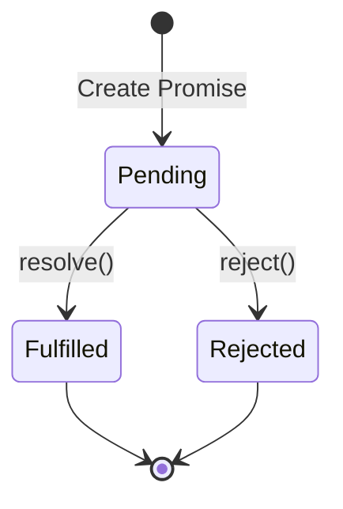

# JavaScript Tutorial - Complete Guide

## Introduction

JavaScript is the language of the web, used extensively in browsers and for building interactive user interfaces. While primarily front-end focused, it can also be used on the back-end with Node.js. This tutorial is designed for experienced programmers who want to learn JavaScript quickly.

**Key Characteristics:**
- Essential for web development alongside CSS and HTML
- Adds interactivity and advanced functionality to websites
- Has unique typing behaviors and nuances not found in other languages
- Can be "weird" compared to other programming languages

## Running JavaScript Code

### Browser Method

JavaScript can be executed directly in HTML files using script tags:

```html
<!DOCTYPE html>
<html>
<body>
    <script>
        console.log("Hello world");
    </script>
</body>
</html>
```

**Insight:** Script tags are typically placed at the bottom of the body to ensure DOM elements are loaded before JavaScript executes.

### External JavaScript Files

```html
<script src="script.js" type="text/javascript"></script>
```

```javascript
// script.js
console.log("Script js");
```

**Insight:** The `type` attribute is optional in modern browsers but can improve code clarity and compatibility.

### Node.js Back-end Execution

After installing Node.js:

```bash
node script.js
```

**Key Difference:** Node.js environment lacks DOM access but provides back-end capabilities.

## Console Output and Comments

### Comment Types

```javascript
// Single line comment

/*
Multi-line comment
Can span multiple lines
*/
```

### Console Output Methods

| Method | Purpose | Visual Indicator |
|--------|---------|------------------|
| `console.log()` | Normal logging | Default text |
| `console.error()` | Error messages | Red text |
| `console.warn()` | Warnings | Yellow text |

### Template Literals (Backticks)

```javascript
const v = 64;
console.log(`v is equal to ${v}`);
```

**Insight:** Backticks (`) enable variable embedding with `${}` syntax, similar to Python's f-strings. Regular quotes won't work for this functionality.

## User Input Collection

### Installing Dependencies

```bash
npm init -y
npm install prompt-sync
```

**Insight:** Creates `package.json` for dependency management and `node_modules` directory for installed packages.

### Input Implementation

```javascript
const prompt = require('prompt-sync')();
const v = prompt("Type something: ");
console.log(v);
```

**Important:** This method only works in Node.js back-end, not in browsers. Browser input uses `prompt()` function instead.

## Variables and Data Types

### Primitive Data Types

| Type | Example | Description |
|------|---------|-------------|
| String | `"hello"`, `'world'`, `` `template` `` | Text wrapped in quotes or backticks |
| Boolean | `true`, `false` | Logical values (lowercase) |
| Number | `12.34`, `8`, `-9` | All numeric values (integers and decimals) |
| Undefined | `undefined` | Unassigned variable value |
| Null | `null` | Explicitly empty value |

**Key Difference:** `null` is explicitly set as nothing, while `undefined` means not yet assigned a value.

### Variable Declaration Keywords

#### `var` - Function Scoped and Hoisted

```javascript
var x = "hello world";
x = "world"; // Can be reassigned
```

**Behavior:**
- Function-scoped (accessible anywhere within function)
- Hoisted (available at function start, but undefined until initialized)
- Can be accessed before declaration without error

#### `let` - Block Scoped

```javascript
let x = 5;
x = 7; // Can be reassigned
x += 1; // Compound assignment works
```

**Behavior:**
- Block-scoped (only accessible within `{}` block)
- Not hoisted (cannot access before declaration)
- Cannot access before initialization

#### `const` - Block Scoped Constant

```javascript
const velocity = 34;
// velocity = 50; // ERROR: Cannot reassign
```

**Insight:** While you can't reassign `const` variables, you can mutate mutable types like arrays or objects stored in them.

### Scoping Demonstration

```javascript
if (true) {
    let x = 3; // Only accessible within this block
}
console.log(x); // ReferenceError with let/const
```

```javascript
if (true) {
    var x = 3; // Function-scoped, accessible outside block
}
console.log(x); // Works fine - prints 3
```

### Variable Naming Conventions

- Use camelCase (not snake_case)
- Cannot start with numbers
- No spaces allowed
- No special characters except underscore and dollar sign

## Arithmetic Operators

### Basic Operators

```javascript
// Standard operators: +, -, *, /, **, %, ++, --
// Compound assignment: +=, -=, *=, /=, %=
```

### Type Coercion Behavior

```javascript
const x = "6";
const y = 7;
console.log(x + y); // "67" - string concatenation
console.log(y + x); // "76" - string concatenation
```

**Critical Insight:** Addition operator (`+`) with mixed types converts numbers to strings for concatenation.

```javascript
console.log(6 + true);  // 7 (true becomes 1)
console.log(6 + false); // 6 (false becomes 0)
```

### Non-Addition Operators

```javascript
console.log("123" * 2);     // 246 - converts string to number
console.log("123" / 2);     // 61.5 - converts string to number
console.log("hello" - 2);   // NaN - cannot convert non-numeric string
```

**Insight:** All arithmetic operators except `+` attempt to convert strings to numbers.

## Type Conversion

### Converting to Numbers

```javascript
// Method 1: Number constructor
console.log(Number("123"));     // 123
console.log(Number(true));      // 1

// Method 2: parseInt (integers only)
console.log(parseInt("234.58px")); // 234

// Method 3: parseFloat (decimal numbers)
console.log(parseFloat("234.58px")); // 234.58
```

### Converting to Strings

```javascript
// Method 1: String constructor
console.log(String(123));

// Method 2: Concatenation with empty string
console.log(123 + "");

// Method 3: toString method
console.log(123..toString());
```

## Comparison Operators

### Loose vs Strict Equality

| Operator | Name | Behavior |
|----------|------|----------|
| `==` | Loose equality | Applies type coercion |
| `===` | Strict equality | Checks value AND type |
| `!=` | Loose inequality | Applies type coercion |
| `!==` | Strict inequality | Checks value AND type |

### Loose Equality Examples

```javascript
console.log(1 == "1");           // true - type coercion
console.log(true == 1);          // true - boolean to number
console.log(null == undefined);  // true - special case
console.log(null == false);      // false - surprising!
console.log("" == 0);            // true - empty string to number
```

### Strict Equality (Recommended)

```javascript
console.log(1 === "1");          // false - different types
console.log(undefined === null); // false - different types
console.log(1 === 1);           // true - same value and type
```

**Best Practice:** Always use strict equality (`===`) and inequality (`!==`) to avoid unexpected type coercion bugs.

## Logical Operators

### Basic Logical Operations

```javascript
// AND (&&), OR (||), NOT (!)
console.log(true && false); // false
console.log(true || false); // true
console.log(!true);         // false
```

### Non-Boolean Behavior

```javascript
console.log("hello" || true);     // "hello" - returns first truthy value
console.log("" || true);          // true - empty string is falsy
console.log(true && "hello");     // "hello" - returns second value if first is truthy
console.log(false && "hello");    // false - returns first value if falsy
```

**Insight:** Logical operators with non-booleans return actual values, not just true/false. This is commonly used in frameworks like React for conditional rendering.

### Truthy/Falsy Values

**Falsy values:** `false`, `0`, `""`, `null`, `undefined`, `NaN`
**Everything else is truthy**

## Conditionals

### Standard If-Else Structure

```javascript
if (condition) {
    // Multiple statements require braces
    console.log("First statement");
    console.log("Second statement");
} else if (anotherCondition) {
    console.log("Else if block");
} else {
    console.log("Else block");
}
```

### Single-Line Conditionals

```javascript
if (true) console.log("Single line - no braces needed");
else console.log("Another single line");
```

**Warning:** Only the first statement after a naked if/else is included. Additional statements execute regardless of condition.

### Ternary Operator

```javascript
const condition = 2 < 3;
const result = condition ? "okay cool" : "no";
console.log(result); // "okay cool"
```

**Use Case:** Perfect for inline conditional assignments and React conditional rendering.

## Switch Statements

```javascript
const value = 3;
switch (value) {
    case 3:
        console.log("three is cool");
        break;
    case 4:
        console.log("four is not cool");
        break;
    default:
        console.log("okay");
}
```

### Switch Fall-through

```javascript
switch (value) {
    case 3:
        console.log("three is cool");
        // No break - falls through to next case
    case 4:
        console.log("four is not cool");
        break;
    default:
        console.log("okay");
}
```

**Critical:** Missing `break` statements cause fall-through behavior where execution continues to subsequent cases.

## Arrays

### Array Creation Methods

```javascript
// Method 1: Literal notation
const arr = [1, 2, 3, true]; // Mixed types allowed

// Method 2: Constructor with size
const arr2 = new Array(5); // Creates array with 5 empty slots

// Method 3: Array.from()
const arr3 = Array.from("hello"); // ["h", "e", "l", "l", "o"]
```

### Array Access and Modification

```javascript
const arr = [1, 2, 3];
arr[0] = "y";              // Modify element
console.log(arr[arr.length - 1]); // Access last element
console.log(arr[10]);      // undefined (no error for out-of-bounds)

// Surprising behavior:
arr[arr.length + 5] = "test";
console.log(arr); // Creates empty slots between existing and new index
```

**Insight:** JavaScript arrays are extremely flexible but can create sparse arrays with empty slots, which can be confusing.

### Essential Array Methods

| Method | Purpose | Example |
|--------|---------|---------|
| `push()` | Add to end | `arr.push(4)` |
| `pop()` | Remove from end | `arr.pop()` |
| `shift()` | Remove from start | `arr.shift()` |
| `unshift()` | Add to start | `arr.unshift("new")` |
| `indexOf()` | Find first occurrence | `arr.indexOf("l")` |
| `lastIndexOf()` | Find last occurrence | `arr.lastIndexOf("l")` |
| `includes()` | Check existence | `arr.includes("l")` |

### Advanced Array Methods

```javascript
// Concatenation
const arr3 = arr1.concat(arr2); // Returns new array

// Join to string
const str = arr.join(" | "); // "element1 | element2 | element3"

// Slice (copy portion)
const portion = arr.slice(1, 3); // Elements from index 1 to 2 (3 not included)

// Splice (remove/modify)
arr.splice(1, 2); // Remove 2 elements starting at index 1
```

### Array Destructuring

```javascript
const coordinates = [1, 2, 3, 4];
const [x, y, ...rest] = coordinates;
console.log(x);    // 1
console.log(y);    // 2
console.log(rest); // [3, 4]
```

### Spread Operator with Arrays

```javascript
const x = [1, 2, 3];
const y = [...x]; // Creates copy, not same reference
const combined = [0, ...x, 4]; // [0, 1, 2, 3, 4]
```

**Insight:** Spread operator creates shallow copies and enables easy array concatenation without mutating originals.

## Loops

### While Loops

```javascript
// Standard while
while (condition) {
    // Loop body
}

// Do-while (executes at least once)
do {
    console.log("Hello");
} while (false); // Still runs once
```

### For Loops

#### Traditional For Loop

```javascript
for (let i = 0; i < 10; i++) {
    console.log(i);
}
```

**Note:** Semicolons are required in for loop declarations for proper delimiting.

#### For-Of Loop (Values)

```javascript
const arr = [4, 5, 6];
for (const value of arr) {
    console.log(value); // Prints 4, 5, 6
}
```

#### For-Of with Entries (Index + Value)

```javascript
for (const [index, value] of arr.entries()) {
    console.log(index, value); // Prints: 0 4, 1 5, 2 6
}
```

**Important:** Use `of` for arrays/iterables, `in` for object properties. Mixing them causes unexpected results.

## Objects

### Object Creation and Properties

```javascript
const obj = {
    name: "Alice",
    age: 23,
    sayHello: function() {
        return "hello";
    }
};
```

### Property Access Methods

```javascript
// Dot notation
console.log(obj.name);
obj.name = "Bob";

// Bracket notation
console.log(obj["name"]);
obj["newProp"] = "value";

// Dynamic property creation
obj.dynamicProperty = [1, 2, 3];
```

### Property Deletion

```javascript
delete obj.career; // Removes property entirely
```

### Object Iteration

```javascript
// Get all values
console.log(Object.values(obj));

// Get all keys
console.log(Object.keys(obj));

// Iterate through keys
for (const key in obj) {
    console.log(key, obj[key]);
}
```

### Object Spreading and Merging

```javascript
const obj1 = { name: "Alice", age: 25 };
const obj2 = { hairColor: "black", name: "Tim" };
const obj3 = { ...obj1, ...obj2 }; // Later properties override earlier ones
```

**Warning:** Spread creates shallow copies. Nested objects/arrays still share references.

```javascript
obj3.career.info = "tech"; // Modifies nested object in both obj and obj3
```

### Object Destructuring

```javascript
const { hairColor, name } = obj3;
console.log(hairColor, name); // Extracts specific properties
```

## Sets

### Set Operations

```javascript
const mySet = new Set([1, 2, 3]); // Initialize with values
// OR
const mySet = new Set(); // Empty set

// Basic operations
mySet.add(4);           // Add element
mySet.delete(2);        // Remove element
mySet.has(1);          // Check existence (O(1) time)
mySet.size;            // Get count
mySet.clear();         // Remove all elements
```

### Set Iteration and Conversion

```javascript
// Iterate
for (const value of mySet) {
    console.log(value);
}

// Convert to array
const arr1 = Array.from(mySet);
const arr2 = [...mySet]; // Using spread operator
```

**Insight:** Sets automatically handle uniqueness and provide O(1) lookup time, making them ideal for deduplication and fast existence checks.

## Maps

### Map Operations

```javascript
// Initialize with key-value pairs
const myMap = new Map([[1, "one"], [2, "two"]]);
// OR
const myMap = new Map();

// Basic operations
myMap.set(4, "four");    // Add/update key-value pair
myMap.get(1);           // Get value by key
myMap.has(1);           // Check if key exists
myMap.delete(2);        // Remove key-value pair
myMap.size;             // Get count
myMap.clear();          // Remove all entries
```

### Map Iteration

```javascript
// Iterate key-value pairs
for (const [key, value] of myMap) {
    console.log(key, value);
}

// Iterate only keys
for (const key of myMap.keys()) {
    console.log(key);
}

// Iterate only values
for (const value of myMap.values()) {
    console.log(value);
}
```

### Map to Array Conversion

```javascript
const arr = Array.from(myMap); // [[key1, value1], [key2, value2]]
```

**Use Case:** Maps are better than objects when you need non-string keys or when key-value pairs are frequently added/removed.

## Error Handling

### Try-Catch-Finally Structure

```javascript
try {
    // Code that might throw an error
    riskyOperation();
} catch (error) {
    // Handle the error
    console.log(error.message);
} finally {
    // Always runs (cleanup code)
    console.log("Cleanup");
}
```

### Throwing Custom Errors

```javascript
throw new Error("This is not good");
```

### Naked Catch (Optional)

```javascript
try {
    riskyOperation();
} catch {
    // Error variable is optional
    console.log("Something went wrong");
}
```

**Best Practice:** Include error parameter to access error details for debugging and user feedback.

## Functions

### Function Declaration Methods

#### Standard Function Declaration

```javascript
function greet(name, age = 12) {
    console.log(`Hello ${name}, age ${age}`);
    return "greeting complete";
}
```

#### Function Expression

```javascript
const greet = function(name) {
    console.log(`Hello ${name}`);
};
```

#### Arrow Function

```javascript
// Multi-line arrow function
const greet = (name) => {
    console.log(`Hello ${name}`);
};

// Single expression (implicit return)
const greet = (name) => `Hello ${name}!`;
```

### Function Features

#### Default Parameters

```javascript
function greet(name, age = 12) {
    // age defaults to 12 if not provided
}
```

#### Rest Parameters

```javascript
function addNums(...numbers) {
    // numbers is an array of all arguments
    return numbers.reduce((sum, num) => sum + num, 0);
}
```

#### Higher-Order Functions

```javascript
function processData(data, callback) {
    return callback(data);
}
```

### Function Scoping Differences

**Regular functions:** `this` is determined by how the function is called
**Arrow functions:** `this` is inherited from the enclosing scope at definition time

```javascript
const person = {
    name: "Alice",
    greet: function() {
        console.log(`Hello, my name is ${this.name}`); // "Alice"
    },
    greetArrow: () => {
        console.log(`Hello, my name is ${this.name}`); // undefined
    }
};
```

## Array Methods: Map, Filter, Reduce

### Map - Transform Each Element

```javascript
const numbers = [1, 2, 3, 4];
const doubled = numbers.map(num => num * 2);
console.log(doubled); // [2, 4, 6, 8]

// With objects
const users = [{name: "Alice"}, {name: "Bob"}];
const names = users.map(user => user.name); // ["Alice", "Bob"]
```

**Insight:** Map creates a new array without modifying the original, perfect for data transformations.

### Filter - Select Elements

```javascript
const numbers = [1, 2, 3, 4];
const evens = numbers.filter(num => num % 2 === 0);
console.log(evens); // [2, 4]
```

### Reduce - Combine to Single Value

```javascript
const numbers = [1, 2, 3, 4];
const sum = numbers.reduce((accumulator, num) => {
    return accumulator + num;
}, 0); // 0 is the initial accumulator value
console.log(sum); // 10
```

**Process Flow:**
1. Start: accumulator = 0, num = 1 → return 0 + 1 = 1
2. Next: accumulator = 1, num = 2 → return 1 + 2 = 3
3. Next: accumulator = 3, num = 3 → return 3 + 3 = 6
4. Final: accumulator = 6, num = 4 → return 6 + 4 = 10

## The `this` Keyword

### Context-Dependent Behavior

```javascript
const person = {
    name: "Alice",
    greet: function() {
        console.log(`Hello, my name is ${this.name}`);
    }
};

person.greet(); // "Hello, my name is Alice"
```

**Regular Function:** `this` refers to the object that calls the method.

### Arrow Function Difference

```javascript
const person = {
    name: "Alice",
    greet: () => {
        console.log(`Hello, my name is ${this.name}`); // undefined
    }
};
```

**Arrow Function:** `this` is inherited from the enclosing scope at definition time, not call time.

**Key Insight:** Use regular functions for object methods when you need access to the object's properties through `this`.

## Promises

### Promise States



### Creating and Using Promises

```javascript
const myPromise = new Promise((resolve, reject) => {
    // Simulate asynchronous operation
    setTimeout(() => {
        const success = true;
        if (success) {
            resolve("Operation successful");
        } else {
            reject("Operation failed");
        }
    }, 1000);
});

// Handling the promise
myPromise
    .then(result => {
        console.log(result); // Handle success
    })
    .catch(error => {
        console.log(error); // Handle failure
    })
    .finally(() => {
        console.log("Cleanup"); // Always runs
    });
```

### Promise.all for Parallel Operations

```javascript
const promise1 = new Promise(resolve => setTimeout(() => resolve("foo"), 100));
const promise2 = new Promise(resolve => setTimeout(() => resolve("bar"), 500));
const promise3 = new Promise(resolve => setTimeout(() => resolve("baz"), 200));

Promise.all([promise1, promise2, promise3])
    .then(results => {
        console.log(results); // ["foo", "bar", "baz"] after ~500ms
    })
    .catch(error => {
        console.log(error); // First error that occurs
    });
```

**Insight:** `Promise.all` runs promises concurrently, not sequentially. Total time is the longest individual promise, not the sum of all promises.

## Advanced Topics Not Covered

The following JavaScript concepts deserve dedicated study:

- **Prototypes and Inheritance** - JavaScript's prototype-based object system
- **Object-Oriented Programming** - Classes, constructors, and inheritance patterns  
- **Advanced Asynchronous JavaScript** - async/await, event loops, microtasks
- **Modules** - ES6 imports/exports, module systems
- **DOM Manipulation** - Interacting with web page elements
- **Event Handling** - User interactions and event-driven programming
- **Closures** - Function scope and variable persistence
- **Regular Expressions** - Pattern matching and text manipulation

**Recommendation:** Master these fundamentals first, then dive deeper into asynchronous JavaScript and modern frameworks like React.

---

*This guide covers the essential JavaScript concepts needed to start building applications. Practice these concepts extensively before moving to advanced topics or frameworks.*