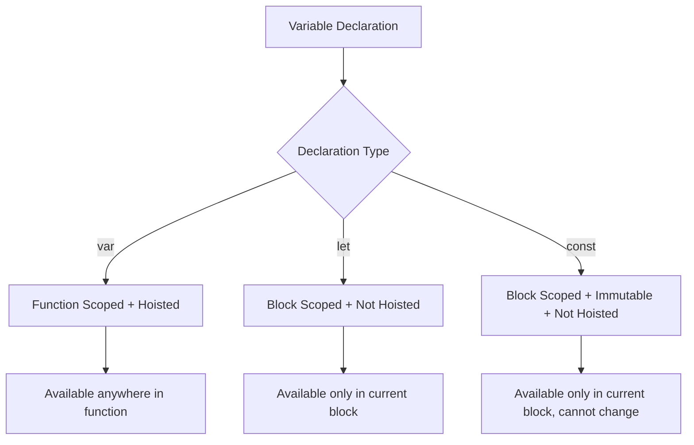
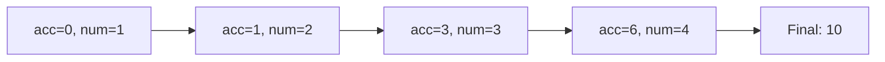
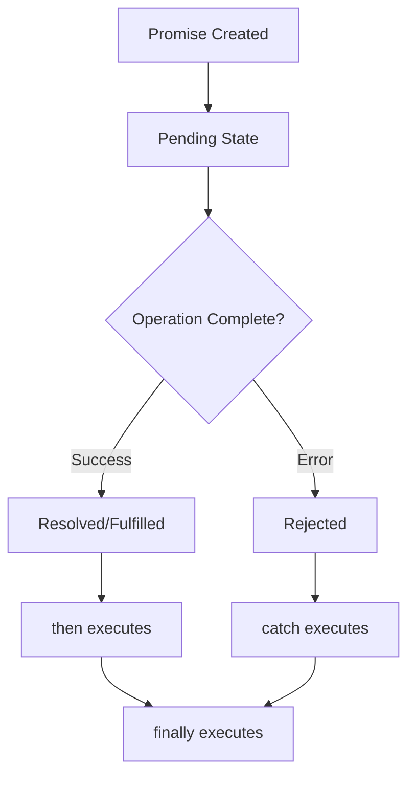

# JavaScript Complete Tutorial Notes

## Introduction and Setup

### Overview
JavaScript is the language of the web, used extensively in browsers and increasingly on the backend. It's essential for interactive user interfaces and works alongside HTML and CSS for web development.

**Key Characteristics:**
- Weird programming language with many nuances
- Dynamic typing with type coercion
- Can run in browser or backend (Node.js)
- Great complementary language for full-stack development

### Running JavaScript Code

#### Method 1: Browser Execution
```html
<!DOCTYPE html>
<html>
<body>
    <script>
        console.log("Hello World");
    </script>
</body>
</html>
```
**Insight:** Script tags at the bottom of body ensure DOM loads before JavaScript executes, preventing common element access errors.

#### Method 2: External Files
```html
<script src="script.js" type="text/javascript"></script>
```
```javascript
// script.js
console.log("Script.js");
```
**Insight:** External files promote code organization and reusability—type attribute is optional but improves code clarity.

#### Method 3: Node.js Backend
```bash
node script.js
```
**Insight:** Node.js allows JavaScript to run server-side, enabling full-stack development with a single language but without DOM access.

## Console Output and Comments

### Comment Types
```javascript
// Single line comment
/* 
   Multiline comment
   spans multiple lines
*/
```

### Console Methods
```javascript
console.log("Normal message");     // Standard output
console.error("Error message");    // Red error text
console.warn("Warning message");   // Yellow warning text
```

### Template Literals (String Interpolation)
```javascript
const v = 64;
console.log(`v is equal to ${v}`); // Output: v is equal to 64
```
**Insight:** Backticks enable variable embedding—similar to Python f-strings but uses `${}` syntax instead of quotation marks.

## User Input Collection

### Backend Input Setup
```bash
npm init -y
npm install prompt-sync
```

### Implementation
```javascript
const prompt = require('prompt-sync')();
const v = prompt("Type something: ");
console.log(v);
```
**Insight:** `require('prompt-sync')()` returns a function that's immediately called—this double-function pattern is common in Node.js modules for configuration.

## Variables and Data Types

### Primitive Data Types

| Type | Example | Description |
|------|---------|-------------|
| String | `"Hello"`, `'World'`, `` `Template` `` | Text data in quotes or backticks |
| Boolean | `true`, `false` | Logical values (lowercase only) |
| Number | `12.34`, `8`, `-9` | All numeric values (no separate int/float) |
| Undefined | `undefined` | Uninitialized or missing value |
| Null | `null` | Explicitly empty value |

**Key Difference:** `null` is explicitly set as empty, `undefined` means not yet assigned—they're different types despite both meaning "nothing."

### Variable Declaration Methods

#### var (Function-scoped, Hoisted)
```javascript
var x = "hello world";
x = "world"; // Can be reassigned
```

#### let (Block-scoped)
```javascript
let x = 5;
x = 7; // Can be reassigned
x += 1; // Compound assignment works
```

#### const (Block-scoped, Immutable)
```javascript
const velocity = 34;
// velocity = 35; // ERROR: Cannot reassign
```

### Scoping Differences



#### Block Scoping Example
```javascript
if (true) {
    let x = 3; // Only accessible within this block
}
// console.log(x); // ERROR: x is not defined
```

#### Function Scoping and Hoisting Example
```javascript
function test() {
    console.log(x); // undefined (not error due to hoisting)
    var x = "test";
    console.log(x); // "test"
}
```
**Insight:** `var` variables are "hoisted" to function top but not initialized—they exist but hold `undefined` until assigned.

## Arithmetic Operations and Type Coercion

### Standard Operators
```javascript
// Basic arithmetic
+, -, *, /, **, %, ++, --
// Assignment operators  
+=, -=, *=, /=, %=
```

### Type Coercion Behavior

| Operation | Result | Explanation |
|-----------|--------|-------------|
| `"6" + 7` | `"67"` | String concatenation (number converts to string) |
| `"6" - 7` | `-1` | Numeric subtraction (string converts to number) |
| `6 + true` | `7` | Boolean converts to number (true = 1) |
| `6 + false` | `6` | Boolean converts to number (false = 0) |
| `"hello" - 2` | `NaN` | Non-numeric string becomes Not a Number |

**Critical Insight:** JavaScript's automatic type conversion is unpredictable—always explicitly convert types to avoid bugs.

### Type Conversion Methods

#### To Number
```javascript
Number("234")        // 234
parseInt("234px")    // 234 (ignores non-numeric suffix)  
parseFloat("23.4")   // 23.4
```

#### To String  
```javascript
String(123)          // "123"
(123).toString()     // "123"  
123 + ""            // "123" (concatenation trick)
```

**Insight:** `parseInt()` is particularly useful for CSS values like "150px" where you need just the numeric part.

## Comparison Operators

### Equality Types

| Operator | Name | Behavior |
|----------|------|----------|
| `==` | Loose equality | Performs type coercion |
| `===` | Strict equality | Checks value AND type |
| `!=` | Loose inequality | Performs type coercion |
| `!==` | Strict inequality | Checks value AND type |

### Loose Equality Quirks
```javascript
1 == "1"              // true (string converts to number)
true == 1             // true  
null == undefined     // true (special case)
null == false         // false (null ≠ any boolean)
undefined == false    // false (undefined ≠ any boolean)
"" == 0              // true (empty string converts to 0)
```

**Critical Rule:** Always use `===` and `!==` to avoid unexpected behavior—loose equality causes many JavaScript bugs.

## Logical Operators

### Basic Operators
```javascript
&&  // AND
||  // OR  
!   // NOT
```

### Non-Boolean Behavior
```javascript
"hello" || true      // "hello" (returns first truthy value)
"" || true          // true (empty string is falsy)
true && "hello"     // "hello" (returns second value if first is truthy)
false && "hello"    // false (returns first value if falsy)
```

**Insight:** Logical operators don't always return booleans—they return one of the operand values, which is useful for default value assignment.

## Control Structures

### Conditional Statements

#### Standard If-Else
```javascript
if (condition) {
    console.log("Hello World");
} else if (anotherCondition) {
    console.log("Do something");
} else {
    console.log("Default action");
}
```

#### Single-Line Conditionals
```javascript
if (true) console.log("Single line");
else console.log("Another single line");
```
**Warning:** Single-line conditionals work for one statement only—additional statements aren't included in the condition.

#### Ternary Operator
```javascript
const condition = 2 < 3 ? "okay cool" : "no";
console.log(condition); // "okay cool"
```
**Insight:** Ternary operators are perfect for conditional assignments and are heavily used in React for conditional rendering.

### Switch Statements
```javascript
const value = 3;
switch (value) {
    case 3:
        console.log("3 is cool");
        break;
    case 4:
        console.log("4 is not cool");  
        break;
    default:
        console.log("okay");
}
```

**Critical Warning:** Forgetting `break` statements causes fall-through behavior where multiple cases execute:

```javascript
switch (value) {
    case 3:
        console.log("3 is cool");
        // Missing break causes fall-through
    case 4:
        console.log("4 is not cool");
        break;
}
// Output: "3 is cool" AND "4 is not cool"
```

## Arrays

### Array Creation Methods
```javascript
// Literal notation
const arr = [1, 2, 3, true];

// Constructor with size
const arr2 = new Array(5); // Creates 5 empty slots

// From iterable
const arr3 = Array.from("hello"); // ["h", "e", "l", "l", "o"]
```

### Array Access and Modification
```javascript
arr[0] = "y";                    // Set element
arr[arr.length - 1];             // Access last element
arr[10] = "test";                // Creates sparse array with empty slots
```

**Insight:** JavaScript arrays can have "holes"—accessing non-existent indices returns `undefined`, and assigning beyond array length creates empty slots.

### Essential Array Methods

| Method | Purpose | Example |
|--------|---------|---------|
| `push()` | Add to end | `arr.push(4)` |
| `pop()` | Remove from end | `arr.pop()` |
| `shift()` | Remove from start | `arr.shift()` |
| `unshift()` | Add to start | `arr.unshift("new")` |
| `indexOf()` | Find first index | `arr.indexOf("hello")` |
| `includes()` | Check existence | `arr.includes("hello")` |

### Array Manipulation
```javascript
// Concatenation (returns new array)
const arr3 = arr.concat(arr2);

// Join to string
const str = arr3.join(" | "); // Elements separated by " | "

// Slice (copy portion)
const slice = arr3.slice(1, 3); // Elements 1-2 (3 not included)

// Splice (modify original)
arr3.splice(1, 2); // Remove 2 elements starting at index 1
```

**Key Difference:** `slice()` returns a copy, `splice()` modifies the original array and returns removed elements.

### Advanced Array Features

#### Destructuring Assignment
```javascript
const coords = [1, 2, 3, 4];
const [x, y, ...rest] = coords;
// x = 1, y = 2, rest = [3, 4]
```

#### Spread Operator
```javascript
const x = [1, 2, 3];
const y = [...x]; // Creates copy, not same reference
const combined = [1, 2, ...x]; // [1, 2, 1, 2, 3]
```

**Insight:** Spread operator creates shallow copies—essential for avoiding reference sharing bugs in React applications.

## Loop Structures

### While Loops
```javascript
while (condition) {
    // code block
}

// Do-while (executes at least once)
do {
    console.log("Hello");
    break; // Prevents infinite loop
} while (true);
```

### For Loops

#### Traditional For Loop
```javascript
for (let i = 0; i < 10; i++) {
    console.log(i);
}
```

#### For-Of Loop (Values)
```javascript
const arr = [4, 5, 6];
for (const value of arr) {
    console.log(value); // 4, 5, 6
}
```

#### For-Of with Entries (Index + Value)
```javascript
for (const [index, value] of arr.entries()) {
    console.log(index, value); // 0 4, 1 5, 2 6
}
```

**Critical Note:** Use `for...of` for arrays, `for...in` for objects—mixing them causes unexpected behavior.

## Objects

### Object Creation and Access
```javascript
const obj = {
    name: "Alice",
    age: 23,
    sayHello: function() {
        return "hello";
    }
};

// Dot notation
obj.name = "Tim";

// Bracket notation  
obj["name"] = "Tim";

// Add new properties
obj.newProp = [1, 2, 3];
```

### Object Iteration Methods
```javascript
// Get all values
Object.values(obj);

// Get all keys  
Object.keys(obj);

// Loop through keys
for (const key in obj) {
    console.log(key);
}
```

### Object Combination and Copying
```javascript
const obj2 = { hairColor: "black", arr: [1, 2, 3] };
const obj3 = { ...obj, ...obj2 }; // Spread syntax combines objects
```

**Warning:** Spread creates shallow copies—nested objects/arrays share references:
```javascript
obj3.arr.push("tech"); // Modifies both obj2.arr and obj3.arr
obj3.hairColor = "brown"; // Only modifies obj3.hairColor
```

### Object Destructuring
```javascript
const { hairColor, name } = obj3;
console.log(hairColor, name); // Extracts specific properties
```

## Sets and Maps

### Sets (Unique Values)
```javascript
const mySet = new Set([1, 2, 3]);

mySet.add(4);           // Add element
mySet.delete(1);        // Remove element  
mySet.has(2);           // Check existence (O(1) time)
mySet.size;             // Get size
mySet.clear();          // Remove all elements

// Convert to array
const arr = Array.from(mySet);
const arr2 = [...mySet]; // Using spread
```

### Maps (Key-Value Pairs)
```javascript
const myMap = new Map([[1, "one"], [2, "two"]]);

myMap.set(4, "four");   // Add/update
myMap.get(1);           // Get value ("one")
myMap.delete(2);        // Remove by key
myMap.has(1);           // Check key existence
myMap.size;             // Get size

// Iteration
for (const [key, value] of myMap) {
    console.log(key, value);
}

// Keys or values only
for (const key of myMap.keys()) { }
for (const value of myMap.values()) { }
```

## Error Handling

### Try-Catch-Finally Structure
```javascript
try {
    // Risky code
} catch (error) {
    console.log(error.message); // Handle error
} finally {
    console.log("Cleanup code"); // Always executes
}

// Naked catch (no error variable)
try {
    // code
} catch {
    // handle without accessing error
}
```

### Throwing Custom Errors
```javascript
throw new Error("This is not good");
```

**Insight:** Always include meaningful error messages and consider creating custom error types for better debugging.

## Functions

### Function Declaration Methods

#### Function Declaration
```javascript
function greet(name, age = 12) {
    return `Hello ${name}, age ${age}`;
}
```

#### Function Expression  
```javascript
const greet = function(name) {
    return `Hello ${name}`;
};
```

#### Arrow Function
```javascript
const greet = (name) => {
    return `Hello ${name}`;
};

// One-liner (implicit return)
const greet = name => name + "!";
```

### Rest Parameters
```javascript
function addNums(...numbers) {
    // numbers is an array of all arguments
    return numbers.reduce((sum, num) => sum + num, 0);
}
```

**Insight:** Rest parameters handle variable argument counts elegantly—perfect for utility functions that work with unknown parameter counts.

## Advanced Array Methods

### Map (Transform Each Element)
```javascript
const numbers = [1, 2, 3, 4];
const doubled = numbers.map(num => num * 2); // [2, 4, 6, 8]

// Extract properties from objects
const users = [{name: "Alice"}, {name: "Bob"}];
const names = users.map(user => user.name); // ["Alice", "Bob"]
```

### Filter (Keep Elements Meeting Criteria)
```javascript
const numbers = [1, 2, 3, 4, 5, 6];
const evens = numbers.filter(num => num % 2 === 0); // [2, 4, 6]
```

### Reduce (Combine Into Single Value)
```javascript
const numbers = [1, 2, 3, 4];
const sum = numbers.reduce((acc, num) => acc + num, 0); // 10
```

**Process Flow:**


**Insight:** These methods are heavily used in React for data transformation and are preferred over traditional loops for functional programming style.

## The 'this' Keyword and Scope

### Regular Function Context
```javascript
const person = {
    name: "Alice",
    greet: function() {
        return `Hello, my name is ${this.name}`;
    }
};

person.greet(); // "Hello, my name is Alice"
```

### Arrow Function Context Issue
```javascript
const person = {
    name: "Alice", 
    greet: () => {
        return `Hello, my name is ${this.name}`; // undefined!
    }
};
```

**Critical Difference:** 

| Function Type | `this` Binding |
|---------------|----------------|
| Regular function | Determined by how it's called |
| Arrow function | Inherited from where it's defined |

**Insight:** Arrow functions inherit `this` from the enclosing scope at definition time, not call time—avoid them for object methods that need access to the object.

## Promises and Asynchronous JavaScript

### Promise Structure
```javascript
const myPromise = new Promise((resolve, reject) => {
    setTimeout(() => {
        const success = true;
        if (success) {
            resolve("good");
        } else {
            reject("bad");  
        }
    }, 2000);
});
```

### Promise States


### Promise Handling
```javascript
myPromise
    .then(value => console.log(value))      // Handle success
    .catch(error => console.log(error))     // Handle error  
    .finally(() => console.log("always"));  // Always executes
```

### Parallel Promise Execution
```javascript
const promise1 = new Promise(resolve => setTimeout(() => resolve("foo"), 100));
const promise2 = new Promise(resolve => setTimeout(() => resolve("bar"), 500));

Promise.all([promise1, promise2])
    .then(results => console.log(results))  // ["foo", "bar"]
    .catch(error => console.log(error));    // First error encountered
```

**Key Benefit:** `Promise.all()` runs promises concurrently rather than sequentially, dramatically reducing total execution time for independent operations.

## Summary and Next Steps

This tutorial covers JavaScript fundamentals including:
- Variable declarations and scoping
- Type coercion and conversion  
- Control structures and loops
- Arrays, objects, sets, and maps
- Functions and arrow functions
- Array methods (map, filter, reduce)
- The `this` keyword behavior
- Basic promises and asynchronous operations

**Recommended Further Learning:**
- Prototypes and Object-Oriented Programming
- Advanced asynchronous JavaScript (async/await, fetch API)
- JavaScript frameworks (React, Vue, Angular)
- Node.js backend development
- Modern JavaScript features (ES6+)

**Critical Takeaways:**
- Always use strict equality (`===`) over loose equality (`==`)
- Be aware of JavaScript's automatic type coercion
- Understand scoping differences between `var`, `let`, and `const`
- Use arrow functions carefully—they behave differently with `this`
- Practice with promises as they're essential for modern JavaScript development